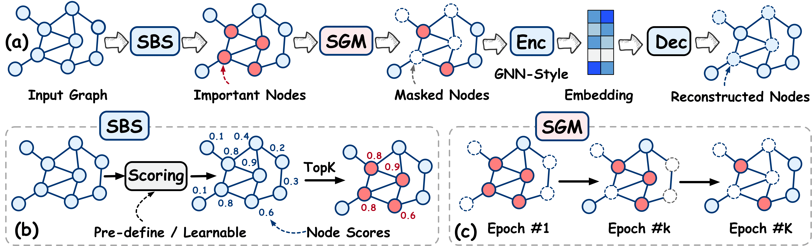

# Where to Mask: Structure-Guided Masking for Graph Masked Autoencoders [IJCAI 2024]


## Overview



This paper presents **StructMAE**, a novel structure-guided masking strategy designed to refine the existing graph masked autoencoder (GMAE) models. StructMAE involves two steps: 
1) Structure-based Scoring: Each node is evaluated and assigned a score reflecting its structural significance.  Two distinct types of scoring manners are proposed: predefined and learnable scoring. 
2) Structure-guided Masking: With the obtained assessment scores, we develop an easy-to-hard masking strategy that gradually increases the structural awareness of the self-supervised reconstruction task.

Extensive experiments consistently demonstrate that our StructMAE method outperforms existing state-of-the-art GMAE models in both unsupervised and transfer learning tasks.

### Python environment setup with Conda

#### Environment for unsupervised learning

```
conda create -n structmae-u python=3.8
conda activate structmae-u
pip3 install torch torchvision torchaudio --index-url https://download.pytorch.org/whl/cu118
pip install torch_geometric
pip install ogb
pip install pyyaml
pip install tensorboardX
```

#### Environment for transfer learning

```
conda create -n structmae-t python=3.8
conda activate structmae-t
pip install torch==1.13.1+cu116 torchvision==0.14.1+cu116 torchaudio==0.13.1 --extra-index-url https://download.pytorch.org/whl/cu116
pip install torch_geometric==2.0.3
conda install -c conda-forge rdkit
```

## Running StructMAE

### On unsupervised learning

```
conda activate structmae-u
# Running StructMAE tuned hyperparameters for TuDataset.
sh scripts/run_unsupervised.sh <dataset_name> <gpu_id>
# Or you could run the code manually:
python main_graph.py --dataset IMDB-BINARY --device 0
```

Supported datasets:

- TuDataset: `NCI1`, `PROTEINS`, `MUTAG`, `IMDB-BINARY`, `COLLAB`, `IMDB-MULTI`, `REDDIT-BINARY`

Run the scripts provided or add --use_cfg in command to reproduce the reported results.

### On transfer learning

Please run `cd ./chem` first.

1. pretraining
```
python pretraining.py
```
2. finetuning
```
python finetune.py --input_model_file <model_path> --dataset <dataset_name>
```
Results can be produced by running `sh finetune.sh <dataset_name>`

## Baselines

- GraphMAE: https://github.com/THUDM/GraphMAE
- GraphMAE2: https://github.com/thudm/graphmae2
- Pretrain-GNNs: https://github.com/snap-stanford/pretrain-gnns
- S2GAE: https://github.com/qiaoyu-tan/S2GAE        
- Mole-BERT: https://github.com/junxia97/mole-bert                            
- GIN: https://github.com/weihua916/powerful-gnns   
- DiffPool: https://github.com/RexYing/diffpool
- Infograph: https://github.com/sunfanyunn/InfoGraph
- GraphCL: https://github.com/Shen-Lab/GraphCL 
- JOAO: https://github.com/Shen-Lab/GraphCL_Automated
- GCC: https://github.com/THUDM/GCC
- SimGRACE: https://github.com/junxia97/simgrace
- GraphLOG: https://github.com/DeepGraphLearning/GraphLoG
- RGCL: https://github.com/lsh0520/rgcl


## Datasets

- Datasets used in unsupervised learning will be downloaded automatically using PyG's API when running the code. 
- Datasets used in transfer learning can be downloaded from [here](https://github.com/snap-stanford/pretrain-gnns#dataset-download)

## Acknowledgements
StructMAE is built using [PyG](https://www.pyg.org/) and [GraphMAE](https://github.com/THUDM/GraphMAE/tree/pyg). 
